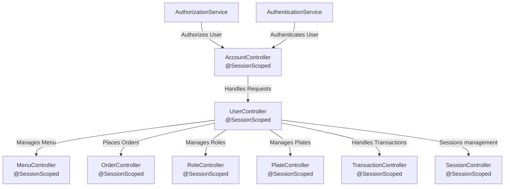

```mermaid
    graph TD;
    AC["AccountController<br/>@SessionScoped"];
    UC["UserController<br/>@SessionScoped"];
    MC["MenuController<br/>@SessionScoped"];
    DC["OrderController<br/>@SessionScoped"];
    RC["RoleController<br/>@SessionScoped"];
    PC["PlateController<br/>@SessionScoped"];
    TC["TransactionController<br/>@SessionScoped"];
    SC["SessionController<br/>@SessionScoped"];
    AR["AuthorizationService"];
    AS["AuthenticationService"];
    AC -->|"Handles Requests"| UC;
    UC -->|"Manages Menu"| MC;
    UC -->|"Places Orders"| DC;
    UC -->|"Manages Roles"| RC;
    UC -->|"Manages Plates"| PC;
    UC -->|"Handles Transactions"| TC;
    UC -->|"Sessions management"| SC;
    AR -->|"Authorizes User"| AC;
    AS -->|"Authenticates User"| AC;
```