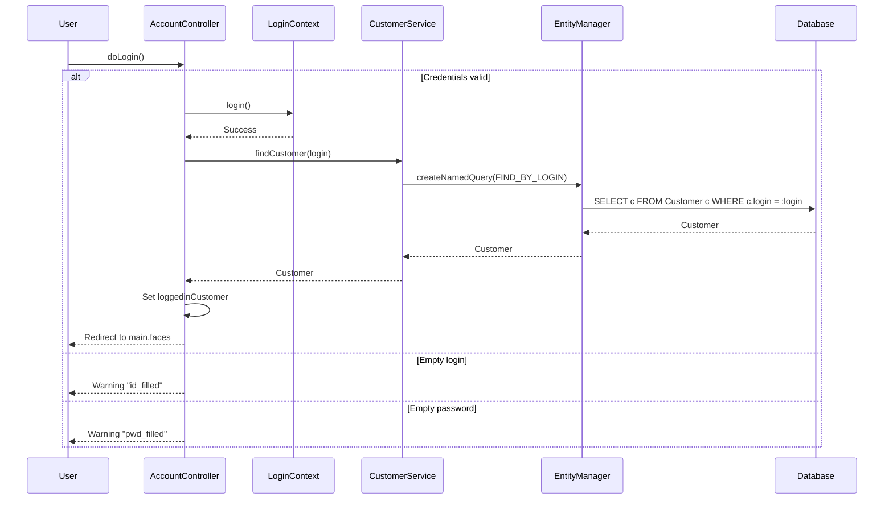

# Java Petstore EE6 - Architecture Documentation

## Table of Contents
1. [High-Level Architecture](#high-level-architecture)
2. [Sequence Diagrams](#sequence-diagrams)
3. [REST API Documentation](#rest-api-documentation)
4. [Component Diagram](#component-diagram)
5. [Database Schema](#database-schema)
6. [Technology Stack](#technology-stack)
7. [Service Layer Documentation](#service-layer-documentation)
8. [Quick Start Guide](#quick-start-guide)

---

## High-Level Architecture

The Java Petstore EE6 application follows a classic multi-tier architecture pattern with clear separation of concerns.

```mermaid
graph TB
    subgraph "Presentation Layer (JSF 2.0)"
        AC[AccountController<br/>@SessionScoped]
        CC[CatalogController<br/>@SessionScoped]
        SCC[ShoppingCartController<br/>@ConversationScoped]
    end
    
    subgraph "REST API Layer (JAX-RS 1.1)"
        CRS[CatalogRestService<br/>@Path /catalog]
    end
    
    subgraph "Service Layer (@Stateless EJB 3.1)"
        CS[CatalogService]
        CUS[CustomerService]
        OS[OrderService]
    end
    
    subgraph "Persistence Layer (JPA 2.0)"
        EM[EntityManager]
    end
    
    subgraph "Database"
        DB[(Derby/H2<br/>Database)]
    end
    
    AC -->|@Inject| CUS
    AC -->|@Inject| Conversation
    CC -->|@Inject| CS
    SCC -->|@Inject| CS
    SCC -->|@Inject| OS
    CRS -->|@Inject| CS
    
    CS -->|@Inject| EM
    CUS -->|@Inject| EM
    OS -->|@Inject| EM
    
    EM -->|JPA| DB
```

### Layer Descriptions

| Layer | Technology | Components | Responsibility |
|-------|------------|------------|----------------|
| Presentation | JSF 2.0 | AccountController, CatalogController, ShoppingCartController | Handle user interactions, manage UI state |
| REST API | JAX-RS 1.1 | CatalogRestService | Expose catalog operations via HTTP |
| Service | EJB Lite 3.1 | CatalogService, CustomerService, OrderService | Business logic, transaction management |
| Persistence | JPA 2.0 | EntityManager | Object-relational mapping |
| Database | Derby/H2 | - | Data storage |

---

## Sequence Diagrams

### 2.1 User Registration Flow


### 2.2 User Login Flow



### 2.3 Browse Catalog Flow


### 2.4 Order Creation Flow


### 2.5 REST API Create Category Flow


---

## REST API Documentation

**Base URL**: `http://localhost:8080/applicationPetstore/rs/catalog`

### Categories Endpoints

#### 1. GET /categories - List all categories

| Property | Value |
|----------|-------|
| **Method** | GET |
| **Path** | `/categories` |
| **Produces** | `application/xml`, `application/json` |
| **Response** | 200 OK with list of categories |

**Example Request (XML response)**:
```bash
curl -X GET http://localhost:8080/applicationPetstore/rs/catalog/categories
```

**Example Request (JSON response)**:
```bash
curl -X GET -H "Accept: application/json" \
  http://localhost:8080/applicationPetstore/rs/catalog/categories
```

**Example Response (JSON)**:
```json
[
  {
    "id": 1,
    "name": "Fish",
    "description": "Any of numerous cold-blooded aquatic vertebrates"
  },
  {
    "id": 2,
    "name": "Dogs",
    "description": "Domesticated carnivorous mammal"
  }
]
```

**Example Response (XML)**:
```xml
<?xml version="1.0" encoding="UTF-8"?>
<collection>
  <category>
    <id>1</id>
    <name>Fish</name>
    <description>Any of numerous cold-blooded aquatic vertebrates</description>
  </category>
  <category>
    <id>2</id>
    <name>Dogs</name>
    <description>Domesticated carnivorous mammal</description>
  </category>
</collection>
```

---

#### 2. GET /category/{id} - Get category by ID

| Property | Value |
|----------|-------|
| **Method** | GET |
| **Path** | `/category/{id}` |
| **Path Parameter** | `id` - Category ID (Long) |
| **Produces** | `application/xml`, `application/json` |
| **Response** | 200 OK with category, 404 if not found |

**Example Request**:
```bash
curl -X GET http://localhost:8080/applicationPetstore/rs/catalog/category/1
```

**Example Request (JSON)**:
```bash
curl -X GET -H "Accept: application/json" \
  http://localhost:8080/applicationPetstore/rs/catalog/category/1
```

**Example Response (JSON)**:
```json
{
  "id": 1,
  "name": "Fish",
  "description": "Any of numerous cold-blooded aquatic vertebrates"
}
```

---

#### 3. POST /category - Create category

| Property | Value |
|----------|-------|
| **Method** | POST |
| **Path** | `/category` |
| **Consumes** | `application/xml`, `application/json` |
| **Response** | 201 Created with Location header |

**Example Request (JSON)**:
```bash
curl -X POST http://localhost:8080/applicationPetstore/rs/catalog/category \
  -H "Content-Type: application/json" \
  -d '{"name":"Birds","description":"Feathered friends"}'
```

**Example Request (XML)**:
```bash
curl -X POST http://localhost:8080/applicationPetstore/rs/catalog/category \
  -H "Content-Type: application/xml" \
  -d '<?xml version="1.0" encoding="UTF-8"?><category><name>Birds</name><description>Feathered friends</description></category>'
```

**Response**:
```
HTTP/1.1 201 Created
Location: http://localhost:8080/applicationPetstore/rs/catalog/category/6
```

---

#### 4. PUT /category - Update category

| Property | Value |
|----------|-------|
| **Method** | PUT |
| **Path** | `/category` |
| **Consumes** | `application/xml`, `application/json` |
| **Response** | 200 OK with updated URI |

**Example Request (JSON)**:
```bash
curl -X PUT http://localhost:8080/applicationPetstore/rs/catalog/category \
  -H "Content-Type: application/json" \
  -d '{"id":1,"name":"Tropical Fish","description":"Exotic fish from tropical waters"}'
```

**Example Request (XML)**:
```bash
curl -X PUT http://localhost:8080/applicationPetstore/rs/catalog/category \
  -H "Content-Type: application/xml" \
  -d '<?xml version="1.0" encoding="UTF-8"?><category><id>1</id><name>Tropical Fish</name><description>Exotic fish from tropical waters</description></category>'
```

**Response**:
```
HTTP/1.1 200 OK
```

---

#### 5. DELETE /category/{id} - Delete category

| Property | Value |
|----------|-------|
| **Method** | DELETE |
| **Path** | `/category/{id}` |
| **Path Parameter** | `id` - Category ID (Long) |
| **Response** | 204 No Content |

**Example Request**:
```bash
curl -X DELETE http://localhost:8080/applicationPetstore/rs/catalog/category/1
```

**Response**:
```
HTTP/1.1 204 No Content
```

---

### Products Endpoints

#### 6. GET /products - List all products

| Property | Value |
|----------|-------|
| **Method** | GET |
| **Path** | `/products` |
| **Produces** | `application/xml`, `application/json` |
| **Response** | 200 OK with list of products |

**Example Request**:
```bash
curl -X GET http://localhost:8080/applicationPetstore/rs/catalog/products
```

**Example Request (JSON)**:
```bash
curl -X GET -H "Accept: application/json" \
  http://localhost:8080/applicationPetstore/rs/catalog/products
```

**Example Response (JSON)**:
```json
[
  {
    "id": 1,
    "name": "Goldfish",
    "description": "Small, golden-colored freshwater fish"
  },
  {
    "id": 2,
    "name": "Koi",
    "description": "Ornamental varieties of domesticated common carp"
  }
]
```

---

#### 7. GET /product/{id} - Get product by ID

| Property | Value |
|----------|-------|
| **Method** | GET |
| **Path** | `/product/{id}` |
| **Path Parameter** | `id` - Product ID (Long) |
| **Produces** | `application/xml`, `application/json` |
| **Response** | 200 OK with product, 404 if not found |

**Example Request**:
```bash
curl -X GET http://localhost:8080/applicationPetstore/rs/catalog/product/1
```

**Example Request (JSON)**:
```bash
curl -X GET -H "Accept: application/json" \
  http://localhost:8080/applicationPetstore/rs/catalog/product/1
```

**Example Response (JSON)**:
```json
{
  "id": 1,
  "name": "Goldfish",
  "description": "Small, golden-colored freshwater fish"
}
```

---

#### 8. POST /product - Create product

| Property | Value |
|----------|-------|
| **Method** | POST |
| **Path** | `/product` |
| **Consumes** | `application/xml`, `application/json` |
| **Response** | 201 Created with Location header |

**Example Request (JSON)**:
```bash
curl -X POST http://localhost:8080/applicationPetstore/rs/catalog/product \
  -H "Content-Type: application/json" \
  -d '{"name":"Betta Fish","description":"Colorful fighting fish"}'
```

**Example Request (XML)**:
```bash
curl -X POST http://localhost:8080/applicationPetstore/rs/catalog/product \
  -H "Content-Type: application/xml" \
  -d '<?xml version="1.0" encoding="UTF-8"?><product><name>Betta Fish</name><description>Colorful fighting fish</description></product>'
```

**Response**:
```
HTTP/1.1 201 Created
Location: http://localhost:8080/applicationPetstore/rs/catalog/product/10
```

---

#### 9. PUT /product - Update product

| Property | Value |
|----------|-------|
| **Method** | PUT |
| **Path** | `/product` |
| **Consumes** | `application/xml`, `application/json` |
| **Response** | 200 OK with updated URI |

**Example Request (JSON)**:
```bash
curl -X PUT http://localhost:8080/applicationPetstore/rs/catalog/product \
  -H "Content-Type: application/json" \
  -d '{"id":1,"name":"Fancy Goldfish","description":"Ornamental goldfish variety"}'
```

**Example Request (XML)**:
```bash
curl -X PUT http://localhost:8080/applicationPetstore/rs/catalog/product \
  -H "Content-Type: application/xml" \
  -d '<?xml version="1.0" encoding="UTF-8"?><product><id>1</id><name>Fancy Goldfish</name><description>Ornamental goldfish variety</description></product>'
```

**Response**:
```
HTTP/1.1 200 OK
```

---

#### 10. DELETE /product/{id} - Delete product

| Property | Value |
|----------|-------|
| **Method** | DELETE |
| **Path** | `/product/{id}` |
| **Path Parameter** | `id` - Product ID (Long) |
| **Response** | 204 No Content |

**Example Request**:
```bash
curl -X DELETE http://localhost:8080/applicationPetstore/rs/catalog/product/1
```

**Response**:
```
HTTP/1.1 204 No Content
```

---

### Items Endpoints

#### 11. GET /items - List all items

| Property | Value |
|----------|-------|
| **Method** | GET |
| **Path** | `/items` |
| **Produces** | `application/xml`, `application/json` |
| **Response** | 200 OK with list of items |

**Example Request**:
```bash
curl -X GET http://localhost:8080/applicationPetstore/rs/catalog/items
```

**Example Request (JSON)**:
```bash
curl -X GET -H "Accept: application/json" \
  http://localhost:8080/applicationPetstore/rs/catalog/items
```

**Example Response (JSON)**:
```json
[
  {
    "id": 1,
    "name": "Small Goldfish",
    "description": "2 inch goldfish",
    "unitCost": 5.99,
    "imagePath": "fish1.jpg"
  },
  {
    "id": 2,
    "name": "Large Goldfish",
    "description": "4 inch goldfish",
    "unitCost": 12.99,
    "imagePath": "fish2.jpg"
  }
]
```

---

#### 12. GET /item/{id} - Get item by ID

| Property | Value |
|----------|-------|
| **Method** | GET |
| **Path** | `/item/{id}` |
| **Path Parameter** | `id` - Item ID (Long) |
| **Produces** | `application/xml`, `application/json` |
| **Response** | 200 OK with item, 404 if not found |

**Example Request**:
```bash
curl -X GET http://localhost:8080/applicationPetstore/rs/catalog/item/1
```

**Example Request (JSON)**:
```bash
curl -X GET -H "Accept: application/json" \
  http://localhost:8080/applicationPetstore/rs/catalog/item/1
```

**Example Response (JSON)**:
```json
{
  "id": 1,
  "name": "Small Goldfish",
  "description": "2 inch goldfish",
  "unitCost": 5.99,
  "imagePath": "fish1.jpg"
}
```

---

#### 13. POST /item - Create item

| Property | Value |
|----------|-------|
| **Method** | POST |
| **Path** | `/item` |
| **Consumes** | `application/xml`, `application/json` |
| **Response** | 201 Created with Location header |

**Example Request (JSON)**:
```bash
curl -X POST http://localhost:8080/applicationPetstore/rs/catalog/item \
  -H "Content-Type: application/json" \
  -d '{"name":"Premium Goldfish","description":"Show quality goldfish","unitCost":29.99,"imagePath":"premium_fish.jpg"}'
```

**Example Request (XML)**:
```bash
curl -X POST http://localhost:8080/applicationPetstore/rs/catalog/item \
  -H "Content-Type: application/xml" \
  -d '<?xml version="1.0" encoding="UTF-8"?><item><name>Premium Goldfish</name><description>Show quality goldfish</description><unitCost>29.99</unitCost><imagePath>premium_fish.jpg</imagePath></item>'
```

**Response**:
```
HTTP/1.1 201 Created
Location: http://localhost:8080/applicationPetstore/rs/catalog/item/25
```

---

#### 14. PUT /item - Update item

| Property | Value |
|----------|-------|
| **Method** | PUT |
| **Path** | `/item` |
| **Consumes** | `application/xml`, `application/json` |
| **Response** | 200 OK with updated URI |

**Example Request (JSON)**:
```bash
curl -X PUT http://localhost:8080/applicationPetstore/rs/catalog/item \
  -H "Content-Type: application/json" \
  -d '{"id":1,"name":"Small Goldfish","description":"2.5 inch goldfish","unitCost":6.99,"imagePath":"fish1.jpg"}'
```

**Example Request (XML)**:
```bash
curl -X PUT http://localhost:8080/applicationPetstore/rs/catalog/item \
  -H "Content-Type: application/xml" \
  -d '<?xml version="1.0" encoding="UTF-8"?><item><id>1</id><name>Small Goldfish</name><description>2.5 inch goldfish</description><unitCost>6.99</unitCost><imagePath>fish1.jpg</imagePath></item>'
```

**Response**:
```
HTTP/1.1 200 OK
```

---

#### 15. DELETE /item/{id} - Delete item

| Property | Value |
|----------|-------|
| **Method** | DELETE |
| **Path** | `/item/{id}` |
| **Path Parameter** | `id` - Item ID (Long) |
| **Response** | 204 No Content |

**Example Request**:
```bash
curl -X DELETE http://localhost:8080/applicationPetstore/rs/catalog/item/5
```

**Response**:
```
HTTP/1.1 204 No Content
```

---

### REST API Response Codes Summary

| Code | Description | When Used |
|------|-------------|-----------|
| 200 | OK | Successful GET or PUT request |
| 201 | Created | Successful POST request |
| 204 | No Content | Successful DELETE request |
| 404 | Not Found | Resource not found |
| 400 | Bad Request | Invalid request data |
| 500 | Internal Server Error | Server-side error |

---

## Component Diagram


---

## Database Schema


### Entity Relationships

| Relationship | Type | Description |
|--------------|------|-------------|
| Category → Product | OneToMany | A category contains multiple products |
| Product → Category | ManyToOne | A product belongs to one category |
| Product → Item | OneToMany | A product contains multiple items |
| Item → Product | ManyToOne | An item belongs to one product |
| Customer → Order | OneToMany | A customer can place multiple orders |
| Order → Customer | ManyToOne | An order belongs to one customer |
| Order → OrderLine | OneToMany | An order contains multiple order lines |
| OrderLine → Item | OneToOne | An order line references one item |
| Customer → Address | Embedded | Customer has embedded home address |
| Order → Address | Embedded | Order has embedded delivery address |
| Order → CreditCard | Embedded | Order has embedded credit card info |

---

## Technology Stack

### Core Technologies

| Technology | Version | Usage |
|------------|---------|-------|
| JPA | 2.0 | Object-Relational Mapping, persistence |
| CDI | 1.0 | Dependency injection with @Inject |
| Bean Validation | 1.0 | Constraint validation (@NotNull, @Size, etc.) |
| EJB Lite | 3.1 | Stateless session beans for services |
| JSF | 2.0 | Web UI with managed beans |
| JAX-RS | 1.1 | RESTful web services |
| JAXB | 2.2 | XML/JSON binding for REST |

### Application Servers

| Server | Version | Profile |
|--------|---------|---------|
| GlassFish | 3.x | Default (embedded and remote) |
| JBoss AS | 7.x | Managed and remote |
| TomEE | 1.x | Embedded with JAX-RS |

### Build & Development

| Tool | Version | Purpose |
|------|---------|---------|
| Maven | 3.x | Build automation |
| JDK | 1.6 | Java runtime |
| Arquillian | 1.1.x | Integration testing |
| JUnit | 4.11 | Unit testing |
| Mockito | 1.9.5 | Mocking framework |
| JaCoCo | 0.5.x | Code coverage |
| JRebel | 1.1.x | Hot reloading |

### Database

| Database | Usage |
|----------|-------|
| Derby | Embedded with GlassFish |
| H2 | Alternative embedded database |

### Frontend

| Technology | Version | Purpose |
|------------|---------|---------|
| Twitter Bootstrap | 2.3.2 | CSS framework |
| jQuery | 1.9.1 | JavaScript library |
| Silk Icons | - | Icon set |
| WebJars | - | Package management for web assets |

### CDI Scopes Used

| Scope | Controller | Description |
|-------|------------|-------------|
| @SessionScoped | AccountController, CatalogController | Maintained per user session |
| @ConversationScoped | ShoppingCartController | Maintained during shopping conversation |
| @Stateless | Services | No state maintained, pooled |

---

## Service Layer Documentation

### CatalogService (@Stateless)

Central service for managing the product catalog including categories, products, and items.

| Method | Parameters | Returns | Description |
|--------|-----------|---------|-------------|
| `findCategory` | `Long id` | `Category` | Find category by ID using EntityManager.find() |
| `findCategory` | `String name` | `Category` | Find category by name using named query FIND_BY_NAME |
| `findAllCategories` | - | `List<Category>` | Get all categories using named query FIND_ALL |
| `createCategory` | `Category category` | `Category` | Persist new category, returns with generated ID |
| `updateCategory` | `Category category` | `Category` | Merge and update existing category |
| `removeCategory` | `Category category` | `void` | Delete category after merging |
| `removeCategory` | `Long categoryId` | `void` | Delete category by ID |
| `findProducts` | `String categoryName` | `List<Product>` | Find products by category name |
| `findProduct` | `Long id` | `Product` | Find product by ID with lazy loading of items |
| `findAllProducts` | - | `List<Product>` | Get all products |
| `createProduct` | `Product product` | `Product` | Persist product, cascades to category if new |
| `updateProduct` | `Product product` | `Product` | Merge and update existing product |
| `removeProduct` | `Product product` | `void` | Delete product after merging |
| `removeProduct` | `Long productId` | `void` | Delete product by ID |
| `findItems` | `Long productId` | `List<Item>` | Find items by product ID |
| `findItem` | `Long id` | `Item` | Find item by ID |
| `searchItems` | `String keyword` | `List<Item>` | Search items by keyword in name/product name |
| `findAllItems` | - | `List<Item>` | Get all items |
| `createItem` | `Item item` | `Item` | Persist item, cascades to product/category if new |
| `updateItem` | `Item item` | `Item` | Merge and update existing item |
| `removeItem` | `Item item` | `void` | Delete item after merging |
| `removeItem` | `Long itemId` | `void` | Delete item by ID |

---

### CustomerService (@Stateless)

Service for managing customer accounts and authentication.

| Method | Parameters | Returns | Description |
|--------|-----------|---------|-------------|
| `doesLoginAlreadyExist` | `String login` | `boolean` | Check if login is already taken |
| `createCustomer` | `Customer customer` | `Customer` | Create new customer account |
| `findCustomer` | `String login` | `Customer` | Find customer by login (returns null if not found) |
| `findCustomer` | `String login, String password` | `Customer` | Authenticate customer by login and password |
| `findAllCustomers` | - | `List<Customer>` | Get all customers |
| `updateCustomer` | `Customer customer` | `Customer` | Update customer account |
| `removeCustomer` | `Customer customer` | `void` | Delete customer account |

---

### OrderService (@Stateless)

Service for managing orders and order processing.

| Method | Parameters | Returns | Description |
|--------|-----------|---------|-------------|
| `createOrder` | `Customer customer, CreditCard creditCard, List<CartItem> cartItems` | `Order` | Create order from shopping cart with order lines |
| `findOrder` | `Long orderId` | `Order` | Find order by ID |
| `findAllOrders` | - | `List<Order>` | Get all orders |
| `removeOrder` | `Order order` | `void` | Delete order |

### Order Creation Process

1. Merge customer to ensure attached to persistence context
2. Create Order with customer, credit card, and delivery address
3. For each CartItem:
   - Merge item to ensure attached
   - Create OrderLine with quantity and item
4. Set order lines on order
5. Persist order (cascades to order lines)
6. Return persisted order with generated ID

---

## Quick Start Guide

### Prerequisites

- JDK 1.6 or higher
- Maven 3.x
- (Optional) GlassFish 3.x, JBoss 7.x, or TomEE 1.x

### Build the Application

```bash
# Clone the repository (example using current fork)
git clone <repository-url>
cd java-petstore-ee6

# Build with Maven
mvn clean install
```

### Run with Embedded GlassFish

```bash
# Package and run with embedded GlassFish
mvn clean package embedded-glassfish:run
```

### Access Points

| Resource | URL |
|----------|-----|
| Web UI | http://localhost:8080/applicationPetstore |
| REST API | http://localhost:8080/applicationPetstore/rs/catalog |

### Test Credentials

| Username | Password |
|----------|----------|
| marc | marc |
| bill | bill |
| jobs | jobs |

### Test REST API

```bash
# Get all categories
curl -X GET http://localhost:8080/applicationPetstore/rs/catalog/categories

# Get all categories as JSON
curl -X GET -H "Accept: application/json" \
  http://localhost:8080/applicationPetstore/rs/catalog/categories

# Get all products as JSON
curl -X GET -H "Accept: application/json" \
  http://localhost:8080/applicationPetstore/rs/catalog/products

# Get all items as JSON
curl -X GET -H "Accept: application/json" \
  http://localhost:8080/applicationPetstore/rs/catalog/items

# Get specific category
curl -X GET http://localhost:8080/applicationPetstore/rs/catalog/category/1

# Create a new category
curl -X POST http://localhost:8080/applicationPetstore/rs/catalog/category \
  -H "Content-Type: application/json" \
  -d '{"name":"Birds","description":"Feathered friends"}'

# Update a category
curl -X PUT http://localhost:8080/applicationPetstore/rs/catalog/category \
  -H "Content-Type: application/json" \
  -d '{"id":1,"name":"Tropical Fish","description":"Exotic fish"}'

# Delete a category
curl -X DELETE http://localhost:8080/applicationPetstore/rs/catalog/category/1
```

### Run Tests

```bash
# Run unit tests
mvn test

# Run integration tests with GlassFish embedded
mvn verify -Pglassfish-embedded

# Run with JBoss AS managed
mvn verify -Pjbossas-managed

# Run with code coverage
mvn verify -Pjacoco
```

### Maven Profiles

| Profile | Description |
|---------|-------------|
| `glassfish-embedded` | Default profile, uses embedded GlassFish |
| `glassfish-remote` | Connects to remote GlassFish instance |
| `jbossas-managed` | Manages JBoss AS lifecycle |
| `jbossas-remote` | Connects to remote JBoss AS |
| `tomee-embedded` | Uses embedded TomEE |
| `jacoco` | Enables code coverage reporting |

---

## Additional Resources

- [Antonio Goncalves](http://www.antoniogoncalves.org) - Original author
- [Java EE 6 Specification](https://jcp.org/en/jsr/detail?id=316)
- [GlassFish Documentation](https://glassfish.org/documentation)
- [Arquillian Testing Framework](http://arquillian.org/)
